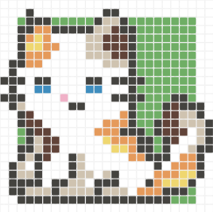

# Colour Thread Workshop
##### 期望成為編織或刺繡創作者的好幫手
##### 編み物や刺繡のクリエーターさんのお手伝いになりますように

<div>

</div>

### Description
Welcome to the Colour Thread Workshop!<br>

This project aims to provide a user-friendly tool for generating color-switchable crochet or embroidery patterns. We've just finished building the pixel art generation part using React and are currently working on enhancing the UI for a more visually appealing interface. Our next step is to develop the color-switching functionality.

### Features
##### Pixel Art Block
1. **Pattern Creation:**
   - Use the pixel art generator to craft unique patterns.
2. **Color Application to Patterns (In Progress):**
   - Randomize applied color combinations on the pattern.
   - Manually adjust color combinations on the pattern.
3. **Pattern Saving:**
   - Save personal patterns.
   - Export colored patterns to PNG files.<br>

##### Task Tracker Block
1. **Task Management:**
   - Add, delete, check, and sort your personal tasks with ease.<br>

_This block was developed as a practice project for the **MERN stack (MongoDB, Express, React, Node.js)**. It is my second side project, and through its development, I gained valuable insights into backend operations and improved my collaboration skills.<br>_
_In my previous project, the front-end and back-end were separated, so I didn't really understand what was happening on the back-end server. However, through this practice project, I began to see the rationale behind some of the data designs my backend partners implemented, which were initially hard for me to understand. This experience has widened my perspective and deepened my understanding._

### Backend Server
The backend server for this project can be found in [colour-database](https://github.com/teienbiyori/colour-database).<br>
Don't forget to clone the backend server as well, or else some parts of this project might end up empty😊

### Dependencies
- axios: "^1.7.2"
- react: "^18.2.0"
- react-color: "^2.19.3"
- react-component-export-image: "^1.0.6"
- react-dom: "^18.2.0"
- sass: "^1.77.0"

### Getting Started
1. **Clone the Repository**
Open your terminal.
Navigate to the directory where you want to clone the project.
Run the following command to clone the repository:
```
git clone https://github.com/teienbiyori/pixel-art-react.git
```
2. **Install project dependencies using npm:**
```
npm install
```
3. **Run Project**
```
npm run dev
``` 
